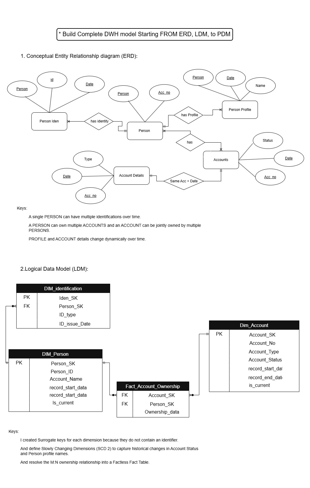
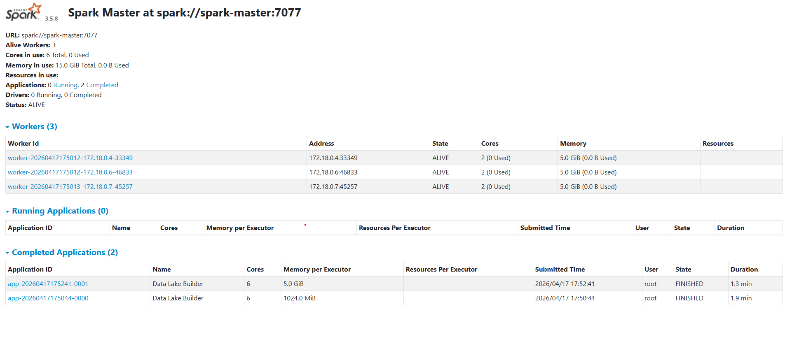

### answer for the Questions:

1. Draw a full data flow for the given data.


and if you need to see the source of flowchart, you can see it in the folder assets/Data_Flow_Architecture/Data_Flow_Architecture.drawio 

2. Build Complete DWH Model starting from ERD, LDM to PDM.



and if you need to see the source of ERD, LDM, you can see it in the folder assets/DWH_Model/DWH_Modeling.drawio.

```sql
-- Dim_Person (SCD2)
CREATE MULTISET TABLE Dim_Person (
    Person_SK INTEGER GENERATED ALWAYS AS IDENTITY (START WITH 1 INCREMENT BY 1),
    Person_ID VARCHAR(50) NOT NULL,
    Person_Name VARCHAR(150),
    Record_Start_Date DATE FORMAT 'YYYY-MM-DD' DEFAULT CURRENT_DATE,
    Record_End_Date DATE FORMAT 'YYYY-MM-DD' DEFAULT '9999-12-31',
    Is_Current BYTEINT DEFAULT 1
) UNIQUE PRIMARY INDEX (Person_SK);

-- Dim_Account (SCD2)
CREATE MULTISET TABLE Dim_Account (
    Account_SK INTEGER GENERATED ALWAYS AS IDENTITY (START WITH 1 INCREMENT BY 1),
    Account_No VARCHAR(50) NOT NULL,
    Account_Type VARCHAR(50),
    Account_Status VARCHAR(50),
    Record_Start_Date DATE FORMAT 'YYYY-MM-DD' DEFAULT CURRENT_DATE,
    Record_End_Date DATE FORMAT 'YYYY-MM-DD' DEFAULT '9999-12-31',
    Is_Current BYTEINT DEFAULT 1
) UNIQUE PRIMARY INDEX (Account_SK);

-- Dim_Identification
CREATE MULTISET TABLE Dim_Identification (
    Iden_SK INTEGER GENERATED ALWAYS AS IDENTITY (START WITH 1 INCREMENT BY 1),
    Person_SK INTEGER NOT NULL,
    ID_Type VARCHAR(25),
    ID_Value VARCHAR(100),
    Issue_Date DATE FORMAT 'YYYY-MM-DD' 
) UNIQUE PRIMARY INDEX (Iden_SK);

-- Fact_Account_Ownership (Factless Fact --> is caled Factless Fact because it does not have any measures)
CREATE MULTISET TABLE Fact_Account_Ownership (
    Account_SK INTEGER NOT NULL,
    Person_SK INTEGER NOT NULL,
    Ownership_Date DATE FORMAT 'YYYY-MM-DD'
) PRIMARY INDEX (Account_SK, Person_SK); 
```
and this is a link of script of PDM : [scripts/Physical Data Model (PDM).sql](scripts/Physical%20Data%20Model%20(PDM).sql)


3. Build Complete Data lake on Big Data architecture.
    - The Data Lake was built using Apache Spark in a distributed environment.
    - Docker was used to create and manage the Spark cluster (Master, Worker, and History Server).
    - Jupyter Notebook was used to develop and execute PySpark transformations.
[build_data_lake notebook](notebooks/build_datalake.ipynb)

    - and this is a spark history jobs:




4. Write SQL to build DWH.

    - (Already included in section 2 under PDM SQL Script)

#### Data Warehouse Physical Model
    - This script defines a Star Schema-based Data Warehouse model using Teradata SQL, designed for analytical reporting and historical tracking. It includes SCD Type 2 dimensions to maintain full history of changes in key entities such as Person and Account, ensuring time-aware analytics.

    - The model also includes a factless fact table to represent account ownership relationships without numerical measures.

    - Key design features include surrogate keys, effective dating (start/end), and current record flags to support efficient querying and data consistency in BI and analytics workloads.

5. Write PySpark to build Data lake.
    - check this notebook: [build_data_lake notebook](notebooks/build_datalake.ipynb)
